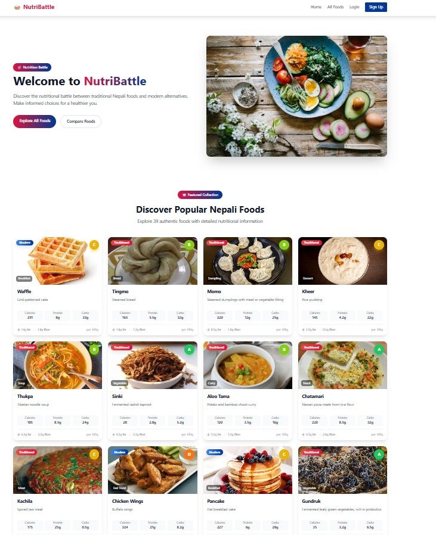
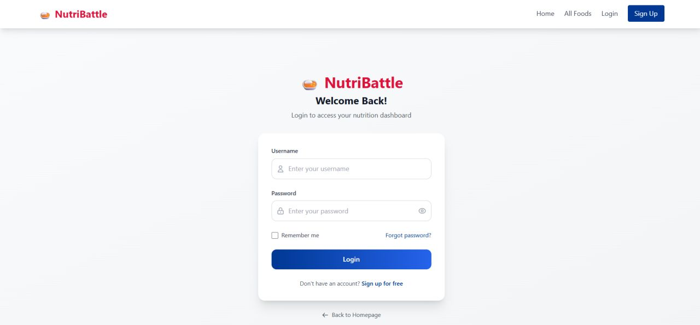
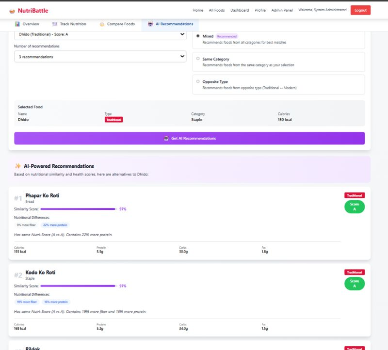

<div align="center">

# 🥗 NutriBattle

### 🇳🇵 Traditional vs Modern Nepali Food Nutrition Comparison Platform

Compare nutritional values, track your daily nutrition, and discover healthier alternatives powered by **K-Nearest Neighbors (KNN) Machine Learning**.


---

### 🌐 Live Features

🥘 Compare Foods • 📊 Track Nutrition • 🤖 AI Food Recommendation • 📈 Nutrition Dashboard • 👨‍💼 Admin Panel

</div>

---

# 📖 About

**NutriBattle** is a full-stack web application that helps users compare the nutritional value of **Traditional Nepali Foods** with **Modern Foods**.

The platform encourages healthier eating habits by providing nutritional analysis, food comparisons, personalized nutrition tracking, and AI-powered recommendations using the **K-Nearest Neighbors (KNN)** algorithm.

Whether you want to know if **Momo is healthier than Pizza** or find a modern alternative to **Gundruk**, NutriBattle makes nutrition comparison simple and interactive.

---

# ✨ Features

## 👤 User Features

- 🔐 Secure Login & Registration
- 🍛 Browse Traditional and Modern Foods
- 🔍 Search Foods
- 📊 Detailed Nutrition Information
- ⚖️ Compare up to 3 Foods
- 📈 Daily Nutrition Tracking
- ❤️ Healthy Food Suggestions
- 🤖 AI Recommendation System using KNN
- 📱 Responsive Design

---

## 🤖 AI Recommendation

NutriBattle uses the **K-Nearest Neighbors (KNN)** Machine Learning Algorithm to recommend foods based on nutritional similarity.

Recommendation Types:

- ✅ Similar Traditional Foods
- ✅ Similar Modern Foods
- ✅ Cross Category Recommendations
- ✅ Mixed Recommendations
- ✅ Opposite Category Alternatives

The recommendation considers nutritional attributes like:

- Calories
- Protein
- Fat
- Carbohydrates
- Fiber
- Sugar
- Sodium

---

## 👨‍💼 Admin Features

- Dashboard Overview
- Food Management (CRUD)
- Category Management
- Nutrition Data Management
- User Management
- Recommendation Dataset Management

---

# 🖼️ Screenshots

## 🏠 Home Page



---

## 🔐 Login



---

## ⚖️ Food Comparison



---

# 🛠️ Tech Stack

## Frontend

- React.js
- React Router
- Axios

---

## Backend

- Spring Boot
- Spring MVC
- Spring Security
- Spring Data JPA
- REST API

---

## Database

- MySQL

---

## Machine Learning

- K-Nearest Neighbors (KNN)

---

## Tools

- IntelliJ IDEA
- VS Code
- Postman
- Git
- GitHub

---

# 📂 Project Structure

```
NutriBattle
│
├── frontend
│   ├── src
│   ├── public
│   └── package.json
│
├── backend
│   ├── controller
│   ├── service
│   ├── repository
│   ├── model
│   ├── security
│   └── resources
│
└── database
```

---

# 🚀 Getting Started

## 1 Clone Repository

```bash
git clone https://github.com/bjnepali7/Nutribattle.git
```

---

## 2 Backend Setup

```bash
cd backend
```

Configure **application.properties**

```properties
spring.datasource.url=jdbc:mysql://localhost:3306/nutribattle
spring.datasource.username=root
spring.datasource.password=yourpassword
```

Run

```bash
mvn spring-boot:run
```

Backend runs on

```
http://localhost:8080
```

---

## 3 Frontend Setup

```bash
cd frontend
npm install
npm start
```

Frontend runs on

```
http://localhost:3000
```

---

# 🧠 How KNN Works

```
User selects a food
          │
          ▼
Extract Nutrition Values
          │
          ▼
Calculate Distance
(Euclidean Distance)
          │
          ▼
Find K Nearest Foods
          │
          ▼
Recommend Similar Foods
```

---

# 📊 Nutrition Parameters

| Parameter | Unit |
|-----------|------|
| Calories | kcal |
| Protein | g |
| Fat | g |
| Carbohydrates | g |
| Fiber | g |
| Sugar | g |
| Sodium | mg |

---

# 🎯 Future Improvements

- 📱 Mobile App
- 🧠 Deep Learning Recommendation
- 🥗 Personalized Diet Plans
- 📷 Food Image Recognition
- 🍽️ Meal Planner
- 🌍 Multi-language Support
- ☁️ Cloud Deployment

---

# 🤝 Contributing

Contributions are welcome!

1. Fork the project
2. Create a feature branch

```bash
git checkout -b feature-name
```

3. Commit

```bash
git commit -m "Added new feature"
```

4. Push

```bash
git push origin feature-name
```

5. Open a Pull Request

---

# ⭐ If you like this project

Please consider giving it a ⭐ on GitHub!

---

# 👨‍💻 Author

**Bijay Nepali**

📧 Email: bjnepali77@gmail.com

🌐 GitHub: https://github.com/bjnepali7

---

<div align="center">

### 🍲 "Healthy Choices Begin with Better Comparisons."

Made with ❤️ using Spring Boot, React and Machine Learning.

</div>
